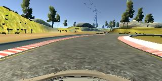
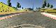
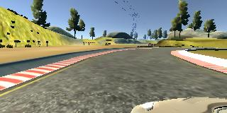
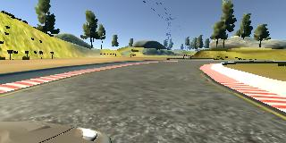
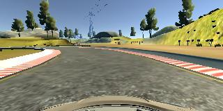
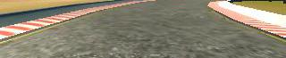

# **Behavioral Cloning**

## Writeup

**Behavioral Cloning Project**

The goals / steps of this project are the following:
* Use the simulator to collect data of good driving behavior
* Build a convolutional neural network in Keras that predicts steering angles from images
* Train and validate the model with a training and validation set
* Test that the model successfully drives around track one without leaving the road
* Summarize the results with a written report

[//]: # (Image References)

[image2]: ./examples/placeholder.png "Grayscaling"
[image3]: ./examples/placeholder_small.png "Recovery Image"
[image4]: ./examples/placeholder_small.png "Recovery Image"
[image5]: ./examples/placeholder_small.png "Recovery Image"
[image6]: ./examples/placeholder_small.png "Normal Image"
[image7]: ./examples/placeholder_small.png "Flipped Image"

### Files Submitted & Code Quality

My project includes the following files:
* model.py containing the script to create and train the model
* preprocess.py to preprocess the recorded camera images before feeding them to the neural network
* drive.py for driving the car in autonomous mode
* model.h5 containing a trained convolutional neural network
* writeup_report.md summarizing the results

Using the Udacity provided simulator and my drive.py file, the car can be driven autonomously around the track by executing
```sh
python drive.py model.h5
```

The model.py file contains the code for training and saving the convolutional neural network. The file shows the pipeline I used for training and validating the model.

### Model Architecture and Training Strategy

#### 1. An appropriate model architecture has been employed

My model consists of a convolutional neural network with two convolutional layers (`Convolution2D(6, 5, 5, activation='relu')`) having both a 5x5 filter and a depth of 6 (model.py function `create_model_LeNet()`)

The model includes two RELU layers each of them immediately following a convolutional layer to introduce nonlinearity (see `activation='relu'`), and the data is normalized in the model using a Keras lambda layer (`Lambda(lambda image: image / 255.0 - 0.5)`).

#### 2. Attempts to reduce overfitting in the model

The model contains max pooling layers `MaxPooling2D()` after each convolutional layer in order to reduce overfitting.

The model was trained and validated on different data sets to ensure that the model was not overfitting. This was accomplished through the statement `model.fit(X_train, y_train, validation_split=0.2, ...)` which sets 20% of the training data `X_train` apart for validation. The model was tested by running it through the simulator and ensuring that the vehicle could stay on the track.

#### 3. Model parameter tuning

The model used an adam optimizer, so the learning rate was not tuned manually (model.py `statement model.compile(... optimizer='adam')`).

#### 4. Appropriate training data

Training data was chosen to keep the vehicle driving on the road. I used a combination of center lane driving and recovering from the left and right sides of the road.

For details about how I created the training data, see the next section.

### Model Architecture and Training Strategy

#### 1. Solution Design Approach

The overall strategy for deriving a model architecture was to start with a simple neural network and gradually adding more layers in order to reduce validation loss.

- simple neural network
- LeNet
- Nvidia (see paper)

My first step was to use a convolutional neural network model similar to the ... I thought this model might be appropriate because ...

In order to gauge how well the model was working, I split my image and steering angle data into a training and validation set. I found that my first model had a low mean squared error on the training set but a high mean squared error on the validation set. This implied that the model was overfitting.

To combat the overfitting, I modified the model so that ...

Then I ...

The final step was to run the simulator to see how well the car was driving around track one. There were a few spots where the vehicle fell off the track... to improve the driving behavior in these cases, I ....

At the end of the process, the vehicle is able to drive autonomously around the track without leaving the road.

#### 2. Final Model Architecture

TODO:
- layers erklären, vor allem warum 40, 80, 30? Tip: Preprocess, resize

The final model architecture (model.py, function `create_model_LeNet()`) is a convolutional neural network derived from [LeNet-5](http://yann.lecun.com/exdb/lenet/). Here is a visualization of the architecture:


#### 3. Creation of the Training Set & Training Process
TODO:
- Flipping Images And Steering Measurements. An effective technique for helping with the left turn bias involves flipping images and taking the opposite sign of the steering measurement.
- left and right camera images, adapt steering: This way, you can teach your model how to steer if the car drifts off to the left or the right.

##### Training Process

To capture good driving behavior, I used the [sample driving data](https://d17h27t6h515a5.cloudfront.net/topher/2016/December/584f6edd_data/data.zip) provided in the lecture to train the network. Here is an example image of center lane driving:



##### Resizing Images to a Quarter



##### Recovery Driving

I then recorded the vehicle recovering from the left side and right sides of the road back to center so that the vehicle would learn to .... These images show what a recovery looks like starting from ... :





steering = 0°.

##### Flipping Images And Steering Measurements

To augment the data set, I also flipped images and angles thinking that this would ... For example, here is an image captured by the center camera showing a right turn:


And then the image has been flipped vertically now showing a left turn:



##### Cropping Images

"Not all of these pixels contain useful information, however. In the image above, the top portion of the image captures trees and hills and sky, and the bottom portion of the image captures the hood of the car.

Your model might train faster if you crop each image to focus on only the portion of the image that is useful for predicting a steering angle."



After the collection process, I had X number of data points. I then preprocessed this data by ...


I finally randomly shuffled the data set and put Y% of the data into a validation set.

I used this training data for training the model. The validation set helped determine if the model was over or under fitting. The ideal number of epochs was Z as evidenced by ... I used an adam optimizer so that manually training the learning rate wasn't necessary.
