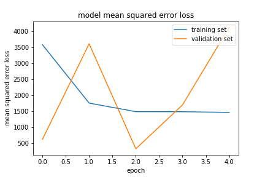

# **Behavioral Cloning**

## Writeup

**Behavioral Cloning Project**

The goals / steps of this project are the following:
* Use the simulator to collect data of good driving behavior
* Build a convolutional neural network in Keras that predicts steering angles from images
* Train and validate the model with a training and validation set
* Test that the model successfully drives around track one without leaving the road
* Summarize the results with a written report

### Files Submitted & Code Quality

My project includes the following files:
* model.py containing the script to create and train the model
* preprocess.py to preprocess the recorded camera images before feeding them to the neural network
* drive.py for driving the car in autonomous mode
* model.h5 containing a trained convolutional neural network
* writeup_report.md summarizing the results

Using the Udacity provided simulator and my drive.py file, the car can be driven autonomously around the track by executing
```sh
python drive.py model.h5
```

The model.py file contains the code for training and saving the convolutional neural network. The file shows the pipeline I used for training and validating the model.

### Model Architecture and Training Strategy

#### 1. An appropriate model architecture has been employed

My model consists of a convolutional neural network with two convolutional layers (`Convolution2D(6, 5, 5, activation='relu')`) having both a 5x5 filter and a depth of 6 (model.py function `create_model_LeNet()`)

The model includes two RELU layers each of them immediately following a convolutional layer to introduce nonlinearity (see `activation='relu'`), and the data is normalized in the model using a Keras lambda layer (`Lambda(lambda image: image / 255.0 - 0.5)`).

#### 2. Attempts to reduce overfitting in the model

The model contains max pooling layers `MaxPooling2D()` after each convolutional layer in order to reduce overfitting.

The model was trained and validated on different data sets to ensure that the model was not overfitting. This was accomplished through the statement `model.fit(X_train, y_train, validation_split=0.2, ...)` which sets 20% of the training data `X_train` apart for validation. The model was tested by running it through the simulator and ensuring that the vehicle could stay on the track.

#### 3. Model parameter tuning

The model used an adam optimizer, so the learning rate was not tuned manually (model.py `statement model.compile(... optimizer='adam')`).

#### 4. Appropriate training data

Training data was chosen to keep the vehicle driving on the road. I used a combination of center lane driving and recovering from the left and right sides of the road.

For details about how I created the training data, see the next section.

### Model Architecture and Training Strategy

#### 1. Solution Design Approach

The overall strategy for deriving a model architecture was to start with a simple neural network and gradually adding more layers in order to reduce validation loss.

simple neural network:



minimal validation loss: 315.80576

LeNet:


minimal validation loss: 0.02058

Nvidia (see paper):


minimal validation loss: 0.02452

My first step was to use a convolutional neural network model similar to the ... I thought this model might be appropriate because ...

In order to gauge how well the model was working, I split my image and steering angle data into a training and validation set. I found that my first model had a low mean squared error on the training set but a high mean squared error on the validation set. This implied that the model was overfitting.

To combat the overfitting, I modified the model so that ...

Then I ...

The final step was to run the simulator to see how well the car was driving around track one. There were a few spots where the vehicle fell off the track... to improve the driving behavior in these cases, I ....

At the end of the process, the vehicle is able to drive autonomously around the track without leaving the road.

#### 2. Final Model Architecture

TODO:
- the type of model used, the number of layers, the size of each layer
- layers erklären, vor allem warum 40, 80, 30? Tip: Preprocess, resize

The final model architecture (model.py, function `create_model_LeNet()`) is a convolutional neural network derived from [LeNet-5](http://yann.lecun.com/exdb/lenet/). Here is a visualization of the architecture:


#### 3. Creation of the Training Set & Training Process

##### Training Process

To capture good driving behavior, I used the [sample driving data](https://d17h27t6h515a5.cloudfront.net/topher/2016/December/584f6edd_data/data.zip) provided in the lecture. Here is an example image of center lane driving:


##### Resizing Images to a Quarter

The training process on my local computer having no GPU was quite slow. A tip from a former udacity student I have found on the net was to resize the images. So I resized the images by adding a keras `AveragePooling2D` layer, which resulted in no performance gain. But resizing the images to a quarter using `cv2.resize()` prior to feeding them to the neural network had the desired positive effect on training speed without worsening validation loss. Here is an example of a resized image:


##### Recovery Driving

I then simulated the car recovering from the left side and right sides of the road back to center so that the car would learn to steer if it drifts off to the left or the right. Following the lecture "Using Multiple Cameras" I exchanged the center camera image with the left (respectively right) camera image and adapted the steering angle in order to steer more to the right (respectively left).

These images show what a recovery looks like starting from the left using a steering angle of 0.2°:


or starting from the right using a steering angle of -0.2°:


##### Flipping Images And Steering Angles

As the trained car often tries to steer to the left (named 'left turn bias' in the lecture "Data Augmentation") the images and steering angles were flipped in order to present the neural network with more right turns and suitable steering angles.

For example, here is an image captured by the center camera showing a left turn:


And then the image has been flipped vertically in order to show a right turn:


##### Cropping Images

As explained in the lecture "Cropping Images in Keras ", not all of the pixels in a camera image contain useful information for predicting steering angles. So the top portion of the image containing trees and hills and sky, and the bottom portion of the image containing the hood of the car are removed using a `Cropping2D` layer within the neural network. Here is an example of a cropped image:


After the collection, preprocessing and augmentation process, I had 38572 images.

I finally randomly shuffled the data set and put 20% of the data into a validation set.

I used this training data for training the model. The validation set helped determine if the model was over or under fitting. The number of epochs was fixed to 5, which is the maximum number of epochs I was willing to wait for results on my local computer. In order to save only the best model params within the 5 epochs I used a `ModelCheckpoint` with `save_best_only=True`. I used an adam optimizer so that manually training the learning rate wasn't necessary.
